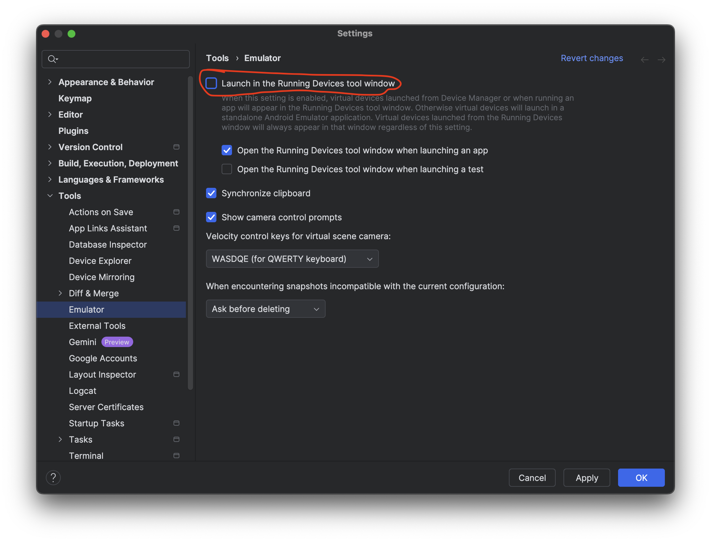

# aosp_device_covesa_emulator

Configuration for building COVESA car emulator within AOSP.

COVESA emulator is a common platform for third-party application developers targeting cars running Android Automotive OS (AAOS) without Google Automotive Services (GAS).

## Import to Android Studio

1. "Tools" -> "SDK Manager" -> "SDK Update Sites" -> "+"
   * Name: COVESA
   * URL: https://emulator.covesa.global/sdk/emulators/covesa-sys-img2-1.xml
2. "OK" -> "Apply"
3. "Tools" -> "Device Manager" -> "+" -> "Create Virtual Device" -> Choose any Automotive variant without Google Play or create your own "New Hardware Profile" -> "Next"
4. COVESA Emulator image should appear in the list of "Recommended" images. Make sure you are choosing correct ABI. Currently COVESA only provides Android 12 (API 31) emulator images for `arm64-v8a` and `x86_64`. -> "Next"
5. AVD Name: "COVESA Android 12 (API 31)" or any other -> "Finish"

### Known issues

* "Runnning Devices" does not show emulator screen starting from Android Studio Meerkat.
  
  `emulator` version (34 or 35) does not make a difference, something changed in Android Studio itself.

  We could not identify the exact reason, but there is a workaround. Disable the "Launch in the Running Devices tool window" setting: 

## How to build

Refer to https://github.com/COVESA/aosp_platform-manifest

For official releases use workflows in https://github.com/COVESA/aosp_platform-manifest/actions

## How to deploy

To test before distribution, simply run `emulator` in your build environment (after `source`, `lunch`, and `m`).

For distribution directly to Android Studio we use these references:

* https://source.android.com/docs/automotive/start/avd/android_virtual_device#create-the-avd-image-xml-file
* device/generic/car/tools/README.md

We need to rename and host the `zip` files generated by `m emu_img_zip` command with respective lunch targets, along with [covesa-sys-img2-1.xml](covesa-sys-img2-1.xml) description of all emulator system images we provide.

[covesa-sys-img2-1.xml](covesa-sys-img2-1.xml) has to be adjusted to provide correct file information, for example:

```xml
<size>687795924</size>
<checksum type="sha1">072c11989d183c4de9f6f778cb4add27e6d6d7c6</checksum>
<url>covesa-avd-arm64-v8a-31_r34.zip</url>
```

Do not leave any `TODO`s in there, otherwise Android Studio would fail to parse it.

## To Consider

* Consider providing prebuilt AVD configurations for easy import in Android Studio.
  This means we need some information about different display configurations from different OEMs. Developers could then have OEM-specific screen sizes which all run the same emulator image.
  See `device/generic/car/tools/README.md`, `device/generic/car/tools/x86_64/devices.xml`, and https://source.android.com/docs/automotive/start/avd/android_virtual_device#create-the-avd-image-xml-file
* Consider cuttlefish instead of (or in parallel to) goldfish
